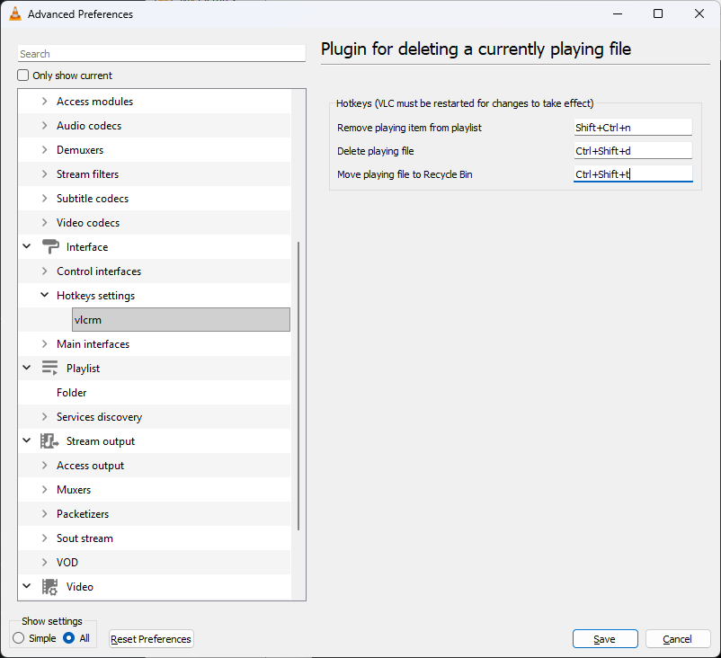

# vlcrm

Simple VLC plugin which allows to delete currently playing file using hotkey.

## Prebuilt binaries

* [Windows x86 32-bit](https://github.com/acc15/vlcrm/releases/download/v1.1.0/vlcrm_win32.zip)
* [Windows x64](https://github.com/acc15/vlcrm/releases/download/v1.1.0/vlcrm_win64.zip)
* [Linux x64](https://github.com/acc15/vlcrm/releases/download/v1.1.0/vlcrm_linux.zip)
* [MacOS (Apple Silicon)](https://github.com/acc15/vlcrm/releases/download/v1.1.0/vlcrm_macos_arm64.zip)
* [MacOS (Intel)](https://github.com/acc15/vlcrm/releases/download/v1.1.0/vlcrm_macos_intel64.zip)

You must extract it to VLC plugins directory:

* Windows: `C:\Program Files\VideoLAN\VLC\plugins\misc`
* MacOS: `/Applications/VLC.app/Contents/MacOS/plugins`
* Linux: `/usr/lib/vlc/plugins/misc`

Then run following command to update VLC plugin cache:

* Windows: `"C:\Program Files\VideoLAN\VLC\vlc-cache-gen.exe" "C:\Program Files\VideoLAN\VLC\plugins"`
* MacOS: `sudo /Applications/VLC.app/Contents/MacOS/vlc-cache-gen /Applications/VLC.app/Contents/MacOS/plugins`
* Linux: `sudo /usr/lib/vlc/vlc-cache-gen /usr/lib/vlc/plugins`

Then follow [Running](#running) guide

## Building

### Prerequisites

* VLC 3.0.20+ must be installed. Previous versions may work, but not tested
* CMake 3.20.0
* Linux or MacOS with C compiler (`GCC` or `Clang`) with C 17 support
* MinGW-w64 to build Windows binaries

VLC recommends compile Windows binaries using MinGW: https://wiki.videolan.org/Win32Compile

Compilation also requires `libvlccore` headers to be available.

On some systems (for example on ArchLinux) they are already in `vlc` package 
and located in `/usr/include/vlc/plugins/` directory.

On MacOS and Windows VLC installation they are absent by default, so it's required to download VLC sources to get those headers.

CMake will automatically download them using `FetchContent` feature if they are not specified using `-DVLC_HEADERS=<path to VLC sources>`.

### Compile

    cmake -DCMAKE_BUILD_TYPE=Release -B build && cmake --build build

#### Windows

Windows build requires either `MSYS2` or some kind of Linux virtual machine (`Docker`, `WSL` or `VirtualBox`)

`MSYS2` or linux machine must have `mingw-w64` installed, to install it on Ubuntu:

    sudo apt-get install mingw-w64 mingw-w64-common

then building is pretty straight-forward using `mingw` compiler:

    cmake -B build -S . \
        -DCMAKE_BUILD_TYPE=Release \
        -DCMAKE_SYSTEM_PROCESSOR=x86_64 \
        -DVLC_LIB="<path to Windows VLC installation available from virtual machine>" \
        && cmake --build build

#### Additional configuration

By default CMake will assume default VLC install locations:

* Windows: `C:\Program Files\VideoLAN\VLC` (`/mnt/c/Program Files/VideoLAN/VLC` will be used actually assuming WSL by default as `VLC_LIB`)
* MacOS: `/Applications/VLC.app/Contents/MacOS`
* Linux: `/usr/lib`

and also it will download VLC sources if they aren't found in `/usr/include/vlc/plugins/` directory. 

There are 3 CMake variables which allows to customize where to search for `libvlccore` headers, library and where to put builded plugin:

| Name          | Description                                                                     |
| ------------- | ------------------------------------------------------------------------------- |
| `VLC_HEADERS` | Path to `libvlccore` headers directory. It's `include` directory of VLC sources |
| `VLC_LIB`     | Path to `libvlccore.[dll/so/dylib]` shared library                              |
| `VLC_PLUGINS` | Path to plugin installation directory                                           |

To specify your own custom directories you can run `cmake` as follows:

    cmake \
        -DCMAKE_BUILD_TYPE=Release \
        -DVLC_HEADERS=/home/user/vlc_sources/include \
        -DVLC_LIB=/home/user/myvlc/lib/libvlccore.so \
        -DVLC_PLUGINS=/home/user/myvlc/lib/plugins/misc \
        -B build && cmake --build build

### Install

    cmake --install build

## Running

Plugin must be explicitly enabled using VLC settings interface:

Restart VLC and plugin should activate. 

You can check it's settings page:

Then just use corresponding hotkeys. 

Note that hotkeys work only in main Video output window (not in playlist or settings window).
If you change the hotkey in the settings page, you will need to restart VLC for the new hotkey to take effect.
